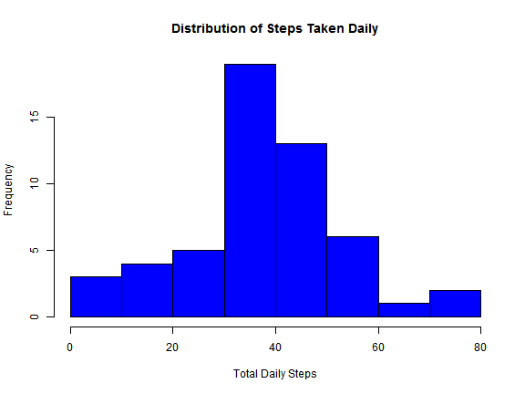
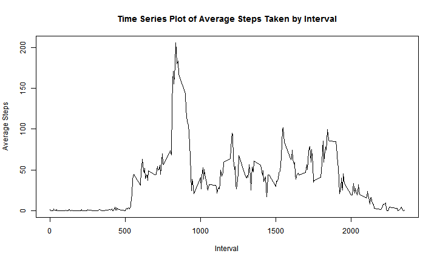
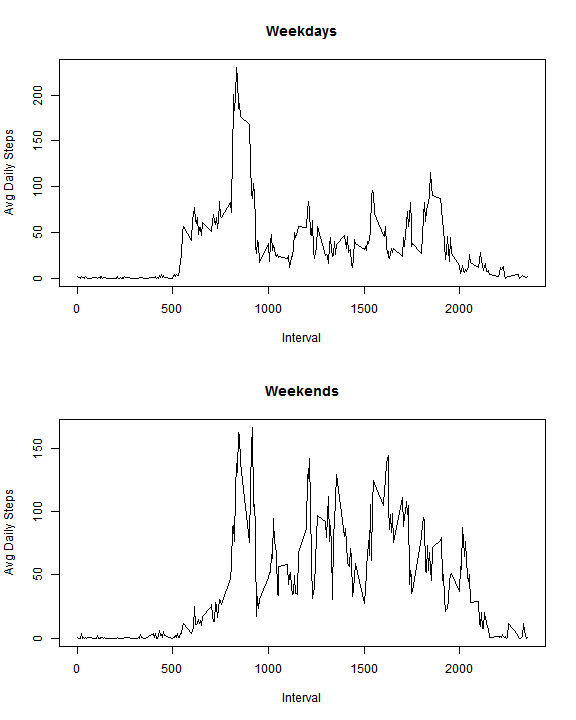

Reproducible Research - Peer Assessment 1
========================================================

## Loading and preprocessing the data


```r
data<-read.csv("C:\\Users\\David\\Documents\\R\\Default_WD\\Reproducible_Research\\activity.csv")
library(data.table)
data2<-data.table(data)
data3<-data2[,mean(steps,na.rm=TRUE),by=date]
```

## What is mean total number of steps taken per day?

### 1. Histogram of daily steps


```r
hist(data3$V1,col="blue",xlab="Total Daily Steps",main="Distribution of Steps Taken Daily")
```

 

### 2. Calculating Mean and Median of the Number of Steps


```r
calcmean<-mean(data3$V1,na.rm=TRUE)
calcmedian<-median(data3$V1,na.rm=TRUE)
```

The mean of the total number of steps taken per day is 37.3826 and the median of the total number of steps taken per day is 37.3785.

## What is the average daily activity pattern?

### 1. Time series plot of average steps take by the time interval


```r
library(data.table)
data4<-data.table(data)
dataavg<-data4[,mean(steps,na.rm=TRUE),by=interval]
plot(dataavg$interval,dataavg$V1,xlab="Interval",type="l", ylab="Average Steps",main="Time Series Plot of Average Steps Taken by Interval")
```

 

### 2. Maximum steps interval


```r
maximumavg<-dataavg$interval[dataavg$V1==max(dataavg$V1)]
```

The interval with the maximum number of steps is 835.

## Imputing missing values

### 1. Calculating and Reporting the Number of Missing Values in the Dataset


```r
missval<-sum(is.na(data[,1]))
```

The total number of missing values in the dataset is 2304.

### 2. Process for imputing the missing values 

The strategy used for imputing missing values is to use the mean of valid values for that interval.


```r
data5<-merge(data,dataavg,by="interval")
for(i in 1:nrow(data))
  {if(is.na(data5$steps[i])){data5$steps[i]=data5$V1[i]}}
```

### 3. New dataset with missing data filled in


```r
data6<-data5[,!(names(data5) %in% "V1")]
library(data.table)
data7<-data.table(data6)
data8<-data7[,mean(steps,na.rm=TRUE),by=date]
```

### 4.a Histogram of daily steps


```r
hist(data3$V1,col="blue",xlab="Total Daily Steps",main="Distribution of Steps Taken Daily with Imputed Data")
```

 

### 4.b Calculating Mean and Median of the Number of Steps


```r
calcmean2<-mean(data8$V1,na.rm=TRUE)
calcmedian2<-median(data8$V1,na.rm=TRUE)
```

The mean of the total number of steps taken per day is 37.3826 and the median of the total number of steps taken per day is 37.3826.

Imputing the missing data has a negligible effect on the overall results. The same conclusions will be drawn with or without imputing the missing data.

## Are there differences in activity Patterns between Weekdays and Weekends?**

**5.1. Creating a New Factor Variable**

```r
data6<-data5[,!(names(data5) %in% "V1")]
data6$date <- strptime(as.character(data6$date), "%Y-%m-%d")
data6["flag"]<-NA
data6["flag"]<-weekdays(data6$date)
data6$flag[data6$flag == "Monday"]="Weekday"
data6$flag[data6$flag == "Tuesday"]="Weekday"
data6$flag[data6$flag == "Wednesday"]="Weekday"
data6$flag[data6$flag == "Thursday"]="Weekday"
data6$flag[data6$flag == "Friday"]="Weekday"
data6$flag[data6$flag == "Saturday"]="Weekend"
data6$flag[data6$flag == "Sunday"]="Weekend"
data6$flag<-as.factor(data6$flag)
```

### 2. Panel plot of time series data

```r
par(mfrow=c(2,1))
weekday<-subset(data6,data6$flag=="Weekday")
weekend<-subset(data6,data6$flag=="Weekend")
library(data.table)
weekday_table<-data.table(weekday)
avg_weekday<-weekday_table[,mean(steps,na.rm=TRUE),by=interval]
avg_weekday<-avg_weekday[order(avg_weekday$interval)]
plot(as.numeric(avg_weekday$interval),avg_weekday$V1,xlab="Interval",type="l", 
     ylab="Avg Daily Steps",main="Weekdays")
library(data.table)
weekend_table<-data.table(weekend)
avg_weekend<-weekend_table[,mean(steps,na.rm=TRUE),by=interval]
avg_weekend<-avg_weekend[order(avg_weekend$interval)]
plot(as.numeric(avg_weekend$interval),avg_weekend$V1,xlab="Interval",type="l", 
    ylab="Avg Daily Steps",main="Weekends")
```

 

Activity patterns differ from weekdays to weekends, with more evening and late night activity during the weekends. However, the peak weekday activity is higher than the peaks in the weekends.
